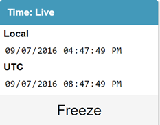

# Temporal

An ASP.NET library enabling easy time traveling at runtime.



## Installation

TODO

<!--
The package is not yet ready:

Install the [Temporal](https://www.nuget.org/packages/Temporal) NuGet package.

```
PM> Install-Package Temporal
```
-->

## Quickstart

In **Startup.cs**:

```csharp
public class Startup
{
    public static readonly TemporalOptions TemporalOptions = new TemporalOptions();

    public void Configuration(IAppBuilder app)
    {
        if (ShouldUseTemporal) // TODO: Implement ShouldUseTemporal or remove this.
        {
            app.UseTemporal(TemporalOptions);
        }
    }
}
```

In **_Layout.cshtml** *(or, any view you want to display the on-screen time machine)*:

```razor
if (ShouldUseTemporal) // TODO: Implement ShouldUseTemporal or remove this.
{
    @Html.Raw(new Temporal.TimeMachine(Startup.TemporalOptions).GetHtml())
}
```

**In code**, use these as necessary:

- `TemporalTime.Now` -- Equivalent to `DateTime.Now` with user time freezing capability.
- `TemporalTime.UtcNow` -- Equivalent to `DateTime.UtcNow` with user time freezing capability.

## Notes

- `UseTemporal` wires up endpoints for the on-screen time machine to use, which enables users to view the current state, freeze time at a specific date and time, and unfreeze time. **Any time freeze requested is scoped to that browser session only.**
- When `UseTemporal` is called, the Temporal endpoints will be available. You may not want this behavior in production.
- Requests, including client-side requests, should include the `CookieTimeProvider` cookie (`__TemporalTime`) to take advantage of time freezing. Otherwise, the current time may be used unexpectedly.
- A static class `TemporalTime` is used, rather than an `ITemporalClock` or equivalent interface. This makes it easier to use as necessary wherever you are in code, without having to worry about getting an instance of the `ITemporalClock` implementation from IoC, etc.

## Contributing

Have an idea? Let's talk about it in an issue!

Find a bug? Open an issue or submit a pull request!

## License

MIT License
